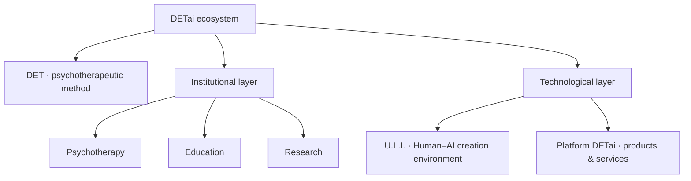

  

<h1 align="center">DETai</h1>

  <strong>AI-Augmented Psychotherapy · DET · Human–AI systems</strong>

  

  
  &nbsp;&nbsp;
  

  
  
  
  

Website and Docs activate with production domains · Telegram channels are live

---

<h2 align="center">What is DETai?</h2>

  <strong>DETai is an ecosystem for AI-Augmented Psychotherapy built around DET, a psychotherapeutic method, and a connected institutional and technological architecture.</strong>

  We bring together psychotherapy, education, research, product development, and Human–AI infrastructure while keeping professional responsibility and human contact at the center.

### Architecture at a glance

 

  

Three deliberately public GitHub surfaces of the DETai ecosystem

<table>
  <tr>
    <td align="center" width="33%">
      
        
      <strong>Long-lived knowledge substrate</strong>
       
      Canonical knowledge, documentation architecture, standards and ecosystem-level source material.
        
      
    </td>
    <td align="center" width="33%">
      
        
      <strong>Public route into the team environment</strong>
       
      Tutorial materials, shared Codex skills and resources for initial DET / DETai workspace setup.
        
      
    </td>
    <td align="center" width="33%">
      
        
      <strong>Public GitHub identity</strong>
       
      Organization profile, shared public metadata and reusable DETai identity assets for GitHub surfaces.
        
      
    </td>
  </tr>
</table>

 

  

<table>
  <tr>
    <td align="center" width="50%">
      
       
      <strong>Anton Kolhonen</strong>
       
      Founder of DETai · author of the DET method Psychotherapy · methodology · research
    </td>
    <td align="center" width="50%">
      
       
      <strong>Vsevolod Arkhipov</strong>
       
      U.L.I. development · platform operations Technology · engineering connectivity
    </td>
  </tr>
</table>

 

  

The production surface is being prepared for the first public baseline of the ecosystem.

<strong>1 September 2026 marks the beginning of the DETai Public Epoch.</strong>

  Psychotherapy · Education · Research · Technology · Human–AI collaboration

