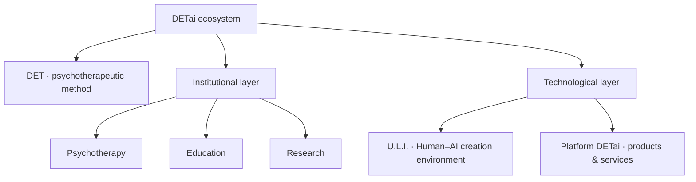

  

<h1 align="center">DETai</h1>

  <strong>AI-Augmented Psychotherapy · DET · Human–AI systems</strong>

  
  
  

  
  
  
  

---

## What is DETai?

**DETai is an ecosystem for AI-Augmented Psychotherapy built around DET, a psychotherapeutic method, and a connected institutional and technological architecture.**

We bring together psychotherapy, education, research, product development, and Human–AI infrastructure while keeping professional responsibility and human contact at the center.

### Architecture at a glance

## Public repositories

| Repository | Role |
|---|---|
| [`sites`](https://github.com/DETai-org/sites) | Next.js monorepo for the DETai ecosystem site and Anton Kolhonen's personal site |
| [`Knowledge_substrate`](https://github.com/DETai-org/Knowledge_substrate) | Canonical knowledge and documentation substrate for the DETai ecosystem |
| [`.github`](https://github.com/DETai-org/.github) | Public organization profile and shared GitHub metadata |

## Team

<table>
  <tr>
    <td align="center" width="50%">
      
       
      <strong>Anton Kolhonen</strong>
       
      Founder of DETai · author of the DET method Psychotherapy · methodology · research
    </td>
    <td align="center" width="50%">
      
       
      <strong>Vsevolod Arkhipov</strong>
       
      U.L.I. development · platform operations Technology · engineering connectivity
    </td>
  </tr>
</table>

## Public launch

The production surface is being prepared for the first public baseline of the ecosystem.

**1 September 2026 marks the beginning of the DETai Public Epoch — Year 1.**

  Psychotherapy · Education · Research · Technology · Human–AI collaboration

